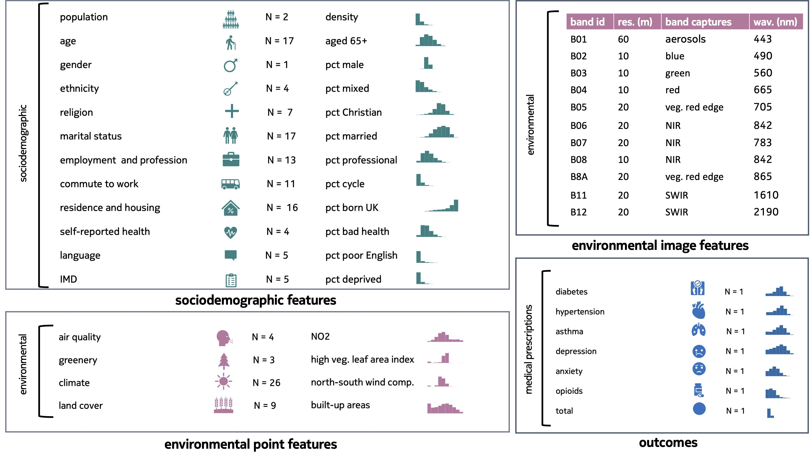
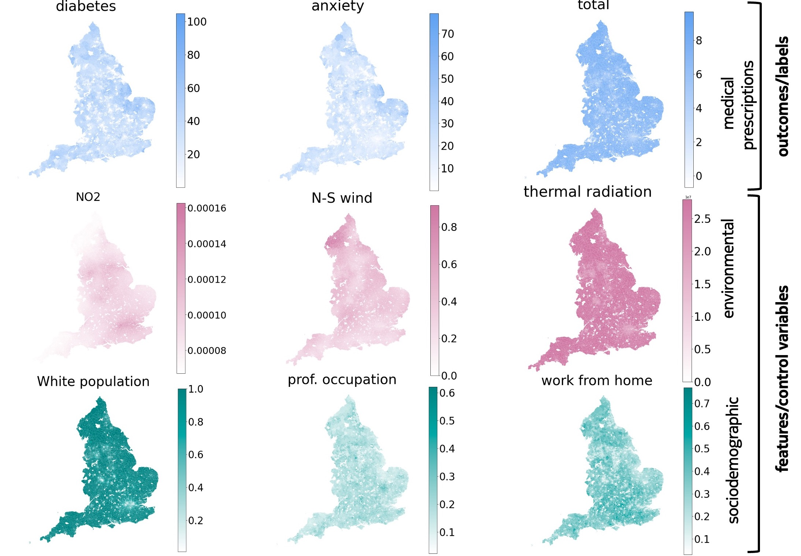
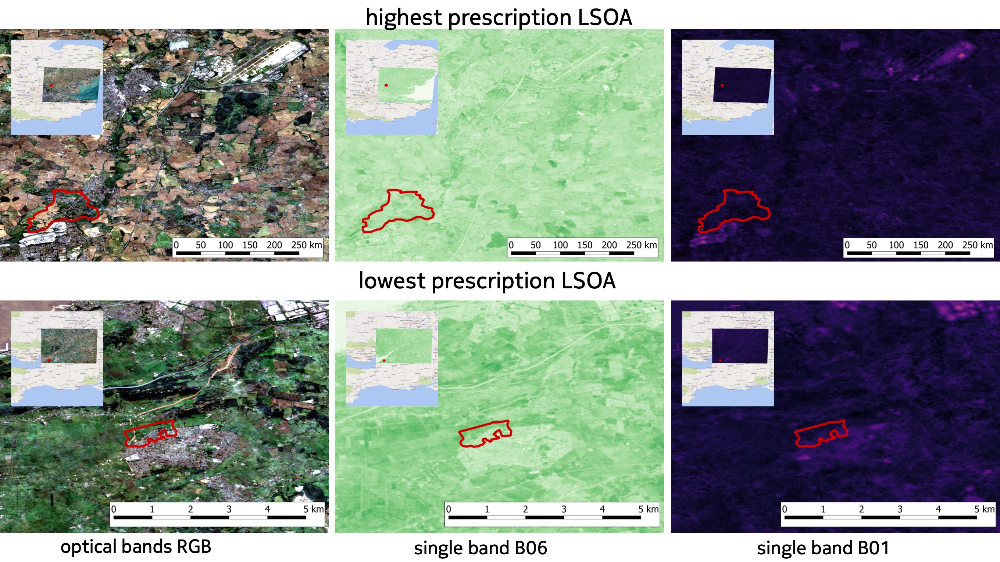
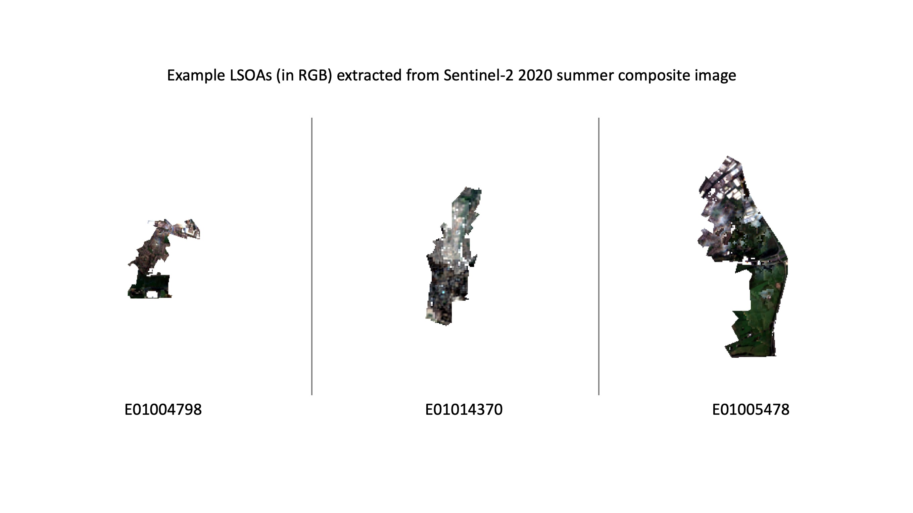

# __MEDSAT__

The code for __MEDSAT__: A public health dataset for England featuring satellite imagery and medical prescriptions.


👩‍⚕️ 🏥 🌲 🏡 💊 💉 🧑‍💼 👨‍👩‍👧‍👦 👶 👵


The __MEDSAT__ dataset serves as a comprehensive resource for public and population health studies in England, encompassing medical prescription quantity per capita as outcomes and a wide array of sociodemographic and environmental variables as features. 
In this release, we provide data snapshots for the years 2019 (pre-COVID) and 2020 (COVID). Sociodemographic variables align with the latest UK census from 2021.




## DATA ACCESS
The data can be found at TUMMedia (data sharing service from Technical University Munich):
    https://mediatum.ub.tum.de/1714817 \
    Login: obadic-1714817-review  | 
    Pass: PuE1&L!maQ;81Hfd-DwPsNa19 \
The dataset is released under the CC BY-SA 4.0 license.


## STRUCTURE

### THE CODE STRUCTURE 
1. `collate_data` -- contains the code for producing the four data components from different sources, and merging them into a single dataset, __MEDSAT__.
    - `data_master.ipynb` -- this code collates the 4 components into single *master data files* for each year. It produces both .csv and .geojson master files as output.
    - `environmental_data_extractor` -- this module produces *environmental point features* and is the only module that requires signing up for an external service, which is Google Earth Engine. The reason is that we collate, process, and analyse enormous amounts of satellite products to calculate the yearly environmental point features. The instructions for signing up and running the extractor code are found in the README file, and we also associated slides with screenshots to help in the process.
    - `image_features_extractor` -- here we provide the code for extracting area-(LSOA)-level features from the Sentinel-2 composite images.  
    - `NHS_prescription_parser` -- this module serves for extracting outcomes for __MEDSAT__ from NHS prescription data.
    - `sociodemographic_data_parser` -- this notebook allows extraction of sociodemographic features per LSOA from the raw files downloaded from the UK ONS website.
2.  `models_and_xai` -- contains the code for predicting and explaining health outcomes from the features.


### THE DATA STRUCTURE 
1. ```auxiliary_data``` -- holds spatial data, i.e., LSOA and Region shapefiles. 
2. ```point_data``` -- contains __MEDSAT__ and its components.
    - ```{year}_spatial_raw_master.csv``` and ```{year}_spatial_raw_master.geojson``` -- the __MEDSAT__ master files.
    - ```data_sources``` -- contains raw input downloaded from the UK Census 2021.
    - ```image_features``` -- contains the features extracted from each image composite band across LSOAs for two seasons: winter (DJF), and summer (JJA) for the year 2020.
    - ```data_components``` -- this is where the results from each module parsing different data sources are placed to be merged into yearly master files.

	

## RUNNING THE CODE

> **STEPS**
1. Download the data from TUMMedia. The structure from the server is mirrored here, which means that you can place the content of ```auxiliary_data``` from the sever into ```auxiliary_data``` in the resposotory and the same for other data folders.

2. Run the code in ```models_and_xai``` to analyse the __MEDSAT__ dataset.

3. If you want to re-create any data component of __MEDSAT__ (e.g., environmental point features, or sociodemographic features), you can `cd` into the module folder, and run the respective module for generating it (1-4 below). For each module, you will find their own README file inside specifying how to use the code within the module. We also provide a specific conda envrionment .yml specification for each module (or a guide for how to setup GEE in the Google Colab environment in the case of ```environmental_data_extractor```). 
    - 1) run the jupyter notebooks from ```environmental_data_extractor``` to obtain *environmental point features*. Since this runs in the Google Colab environment, the results will get saved into your Google Drive, and you can download and place them into ```data/point_data/data_components/{year}_environment.csv```
    - 2) run ```NHS_prescriptions_parser``` to obtain *prescrption outcomes* for selected conditions. The resulting outputs will get placed into ```data/point_data/data_components/{year}_outcomes.csv```
    - 3) `WasdiAverageComposite` runs on WASDI servers to obtain *environmental image features*, i.e., 37 x 4 seasonal Sentinel-2 composite images (totalling ~120 GB per season, i.e., ~600 GB per year). This data is saved on the TUM server (on the data address provided at the beginning of this file). You can download (a part of) this data into ```data/image_data/``` to continue parsing them with the code provided here.
    - 4) run ```sociodemographic_data_parser``` to obtain *sociodemographic features* from the UK census. They will get placed into ```data/point_data/data_components/controls.csv```
    - ```collate data``` pulls the four extracted data components into a single *master file* per year saved into ```data/point_data/{year}_spatial_raw_master``` both as .csv and .geojson. 


## PEAKS INTO THE DATASET

#### Example __MEDSAT__  point features


#### Example __MEDSAT__  image features


#### Example __MEDSAT__  LSOA image features
