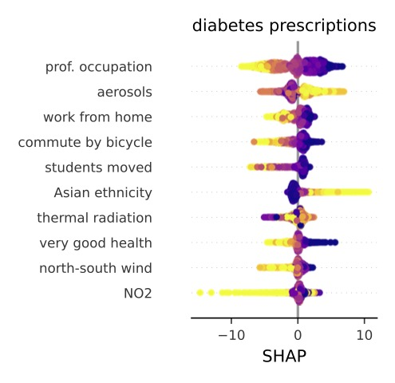
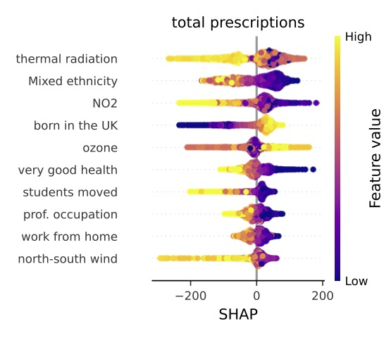

# __MEDSAT__

The code for __MEDSAT__: A public health dataset for England featuring satellite imagery and medical prescriptions.


👩‍⚕️ 🏥 🌲 🏡 💊 💉 🧑‍💼 👨‍👩‍👧‍👦 👶 👵


The __MEDSAT__ dataset serves as a comprehensive resource for public and population health studies in England, encompassing medical prescription quantity per capita as outcomes and a wide array of sociodemographic and environmental variables as features. 
In this release, we provide data snapshots for the years 2019 (pre-COVID) and 2020 (COVID). Sociodemographic variables align with the latest UK census from 2021.


Access to the code is available at this respository, while the data can be found at https://tinyurl.com/medsatpoint. The dataset is released under the CC BY-SA 4.0 license.


### THE STRUCTURE 
For two of the modules below, we provide their own conda environment files (`NHS_prescription_parser`, ), or instructions for how to run the code in Google Colab environment (for `environmental_data_extractor`).
1. `collate_data` -- contains the code for producing the four __MEDSAT__ data segments.
	- `data_master.ipynb` -- this code collates the 4 segments into single master data files for each year. It produces both .csv and .geojson master files as output.
	- `environmental_data_extractor` -- this module produces *envrionmental point features* and is the only module that requires signing up for an external services, which is Google Earth Engine. The reason is that we collate, process, and analyse enormous amounts of satellite products to calculate the yearly envrionmental point features. The instructions for signing up and running the extractr code are found in the README file, and we also associted slides with screenshots to help in the process.
	- `image_features_extractor` -- here we provide the code for extracting area-(LSOA)-level features from the Sentinel-2 composite images.  
	- `NHS_prescription_parser` -- this module serves for extracting outcomes for __MEDSAT__ from NHS prescription data.
	- `sociodemographic_data_parser` -- this notebook allows to extract sociodemographic features per LSOA from the raw files donwloaded from the UK ONS website.


2.  `models_and_xai` -- contains the code for predicting and explaining health outcomes from the features.


> **STEPS**
1. run ```sociodemographic_data_parser``` to obtain sociodemographic indicators from the UK census.
2. run the jupyter notebooks from ```environmental_data_extractor``` to obtain environmental point features.
3. run ```NHS_prescriptions_parser``` to obtain prescrptions for selected conditions.
4. `WasdiAverageComposite` runs on WASDI servers to produce 37 x 4 seasonal Sentinel-2 compsite images, i.e., environmental image features.
5. ```colate data``` pulls the four extracted data segments into a single master file, i.e., __MEDSAT__.
6. run ```models_and_xai``` to analyse the data.


### PEAKS INTO THE DATASET

#### Example __MEDSAT__  point features


#### Example __MEDSAT__  image features


#### Example SHAP results


